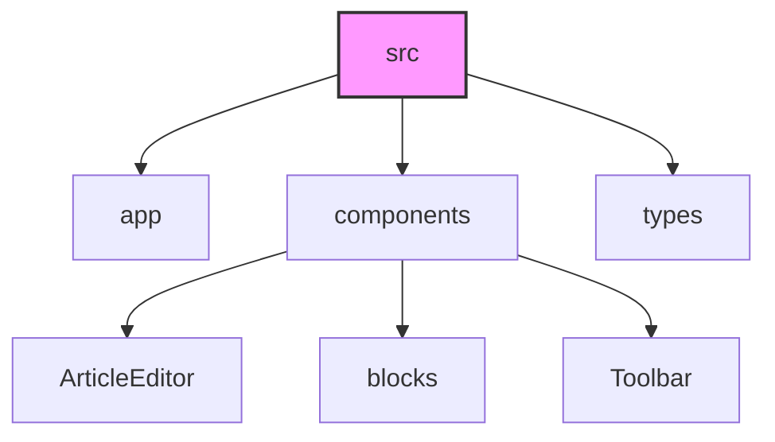

# 📝 Редактор статей

> Современный редактор статей с поддержкой различных типов блоков, включая текст, изображения и математические формулы.

<div align="center">


</div>

---

## ✨ Возможности

| Функция | Описание |
|---------|-----------|
| 📝 **Блоки** | Заголовки, параграфы, изображения, формулы |
| 🎨 **Форматирование** | Богатое форматирование текста |
| 📐 **Формулы** | Поддержка математических формул (LaTeX) |
| 📱 **Адаптивность** | Адаптивный дизайн |
| 🔄 **История** | История изменений |
| 👁 **Предпросмотр** | Предпросмотр статьи |
| 🔍 **JSON** | JSON-представление данных |

## 🛠 Технологии

<div align="center">

| Технология | Описание |
|------------|-----------|
|  | Современный React фреймворк |
|  | Типизация и улучшенная разработка |
|  | Стилизация и адаптивный дизайн |
|  | Расширяемый текстовый редактор |
|  | Рендеринг математических формул |
|  | Библиотека иконок |

</div>

## 🚀 Установка

1. **Клонируйте репозиторий:**

```bash
git clone [url-репозитория]
```

2. **Установите зависимости:**

```bash
npm install
```

3. **Запустите проект:**

```bash
npm run dev
```

4. **Откройте** [http://localhost:3000](http://localhost:3000) в браузере.

## 📖 Использование

### 📑 Работа с блоками

<details>
<summary><b>Создание блоков</b></summary>

- Нажмите кнопку `+` между блоками или в пустом редакторе
- Выберите тип блока из выпадающего меню:
  - `H1`, `H2`, `H3` - заголовки разных уровней
  - `P` - параграф для основного текста
  - `CAPTION` - подпись для изображений
  - `FORMULA` - блок с математической формулой
  - `IMAGE` - блок для изображений

</details>

<details>
<summary><b>Управление блоками</b></summary>

- Наведите на блок для отображения панели управления
- Используйте кнопку `JSON` для просмотра структуры блока
- Кнопка `Удалить` удаляет выбранный блок

</details>

### ✏️ Форматирование текста

<details>
<summary><b>Базовое форматирование</b></summary>

| Функция | Горячие клавиши |
|---------|-----------------|
| **Жирный текст** | `Ctrl/Cmd + B` |
| *Курсив* | `Ctrl/Cmd + I` |
| Подчеркивание | `Ctrl/Cmd + U` |
| Верхний индекс | Специальная кнопка |

</details>

<details>
<summary><b>Выравнивание и списки</b></summary>

#### Выравнивание
- ⬅️ По левому краю (по умолчанию)
- ↔️ По центру
- ➡️ По правому краю

#### Списки
- 🔵 Маркированные списки
- 🔢 Нумерованные списки
- 📝 Вложенные списки

</details>

### 📐 Математические формулы

<details>
<summary><b>Работа с формулами</b></summary>

1. Выберите блок типа `FORMULA`
2. Введите формулу в формате LaTeX
3. Формула отображается в режиме реального времени

**Пример LaTeX формулы:**
```latex
\sum_{i=1}^{n} x_i^2
```

</details>

### 🔍 Предпросмотр и экспорт

<details>
<summary><b>Функции просмотра</b></summary>

#### 👁 Предпросмотр статьи
- 🟢 Зеленая кнопка - предпросмотр
- 📄 Просмотр в формате для чтения
- ❌ Закрытие предпросмотра

#### 📋 JSON-представление
- 🔵 Синяя кнопка - просмотр JSON
- 📝 Просмотр структуры данных
- 📋 Копирование в буфер обмена

</details>

### ⏳ История изменений

| Действие | Горячие клавиши |
|----------|-----------------|
| Отмена (Undo) | `Ctrl/Cmd + Z` |
| Повтор (Redo) | `Ctrl/Cmd + Shift + Z` |

## 📁 Структура проекта



## 👨‍💻 Разработка

### 🛠 Команды

| Команда | Описание |
|---------|-----------|
| `npm run dev` | Запуск в режиме разработки |
| `npm run build` | Сборка проекта |
| `npm run start` | Запуск собранного проекта |
| `npm run lint` | Проверка кода |

### 📦 Добавление новых типов блоков

1. Добавьте новый тип в `src/types/article.ts`
2. Создайте компонент в `src/components/blocks/`
3. Добавьте обработку в `ArticleEditor.tsx`

---

<div align="center">

## 📄 Лицензия

MIT © 2024

</div>
